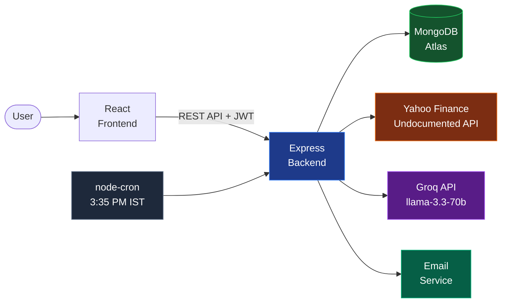
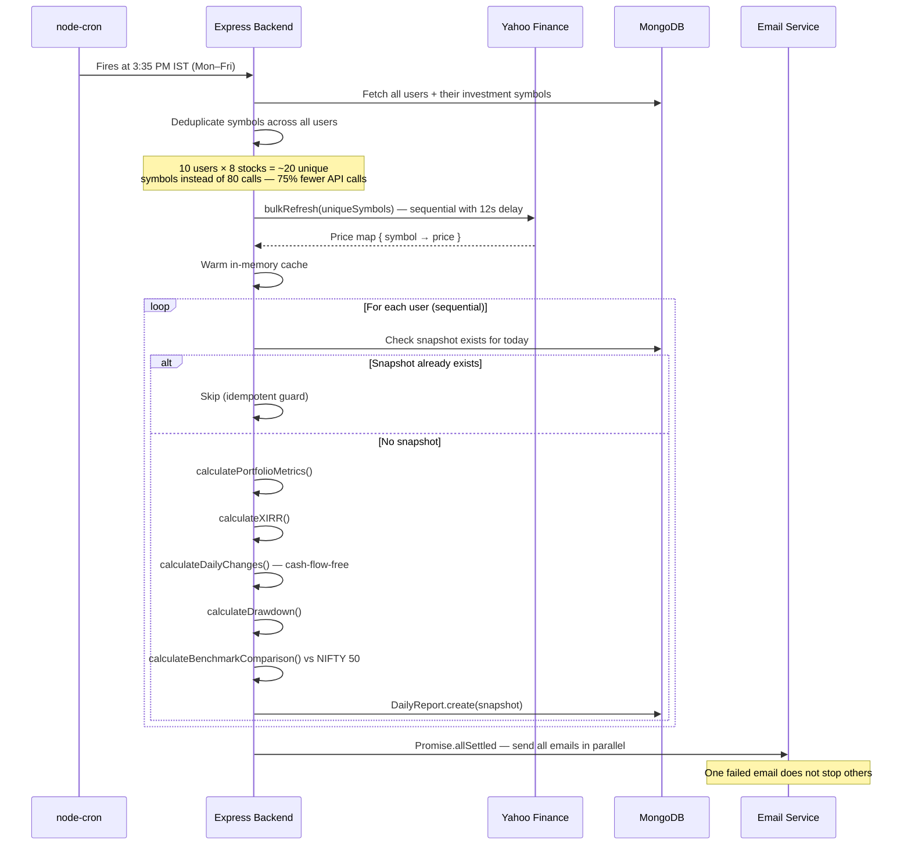
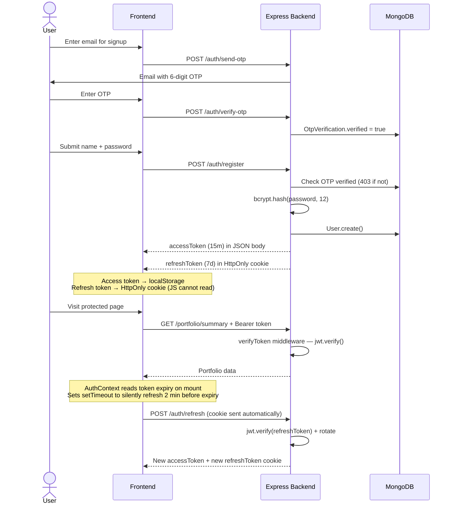
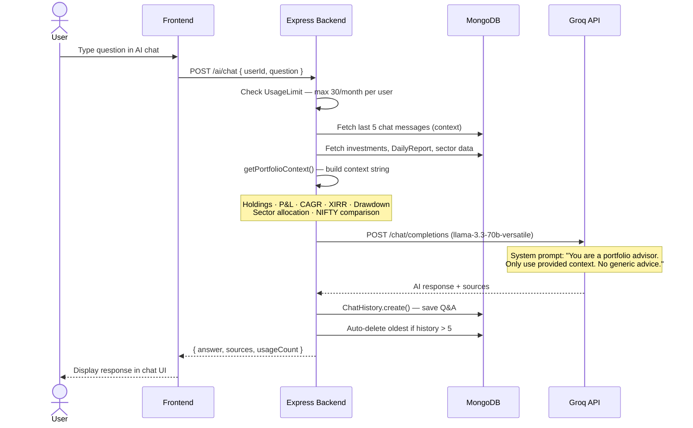

# Dhanalysis — Indian Stock Portfolio Analytics

A full-stack portfolio analytics platform for Indian retail investors. Add your investments and get real-time P&L, CAGR, XIRR, drawdown, Sharpe ratio, and a daily comparison against NIFTY 50 — all in one dashboard.

---

## System Architecture

### High-Level Design



### Daily Snapshot Flow (Cron at 3:35 PM IST)



### Auth Flow



### AI Chat Flow



---

## Features

**Real-time portfolio dashboard.** Total invested, current value, P&L, ROI, CAGR, and XIRR updated every time you load the page. Daily change card shows how today's market moved your portfolio, without counting new investments you added.

**13 portfolio metrics, all explained.** ROI, CAGR, XIRR, Absolute Return, Daily Return, Max Drawdown, Volatility, Sharpe Ratio, Win Rate, Profit Factor, Correlation, Beta, and Benchmark Comparison against NIFTY 50.

**NIFTY 50 benchmark comparison.** Every daily snapshot records the NIFTY 50 value alongside your portfolio. Charts normalize both to 100 at the start of the period so you can directly compare growth regardless of scale.

**AI portfolio advisor powered by Groq.** Ask questions about your portfolio in plain English. The AI receives your actual holdings, metrics, and sector allocation as context — answers are specific to your portfolio, not generic advice.

**FIFO sell simulation.** Enter a quantity to sell and see a live preview of exactly which transactions will be deleted or reduced (oldest first) before you confirm. Calculated entirely on the frontend — no API call until you confirm.

**Daily email report.** After the 3:35 PM snapshot, each user receives an email with their current portfolio value, daily change, and NIFTY comparison for that day.

**Shared price cache — 75% fewer API calls.** Prices are fetched once per day for all unique symbols across all users combined. Ten users holding the same stock = one API call, not ten.

**Dual-token JWT auth.** 15-minute access token in localStorage for API calls. 7-day refresh token in an HttpOnly cookie that JavaScript cannot read. Silent refresh 2 minutes before expiry — users never see a session expired error.

**Three-tier rate limiting.** General API (200 req/15 min), AI endpoints (10 req/hour to protect Groq quota), and auth endpoints (5 req/min to prevent brute force).

**OTP email verification on signup.** Registration requires a verified OTP record — prevents fake accounts and email phishing before any user is created in the database.

---

## Tech Stack

| Layer | Technology |
|---|---|
| Frontend | React 19, TypeScript, Vite, Tailwind CSS, Recharts |
| Backend | Node.js, Express, ES Modules |
| Database | MongoDB Atlas, Mongoose ODM |
| Auth | Custom JWT (jsonwebtoken, bcryptjs) |
| AI | Groq API — llama-3.3-70b-versatile |
| Stock Prices | Yahoo Finance (undocumented API, browser-like headers) |
| Email | Nodemailer / Resend |
| Cron | node-cron (`35 15 * * 1-5`, Asia/Kolkata timezone) |
| Rate Limiting | express-rate-limit (in-memory, single instance) |
| Deployment | Render (backend), Vercel (frontend) |

---

## Install and Run

### Prerequisites

Node.js 18 or later. A MongoDB Atlas connection string. A Groq API key (free tier available).

### 1. Clone and configure

```bash
git clone <repo-url>
cd Dhanalysis

# Backend env
cp backend/.env.example backend/.env
# Fill in: MONGO_URI, JWT_SECRET, JWT_REFRESH_SECRET, GROQ_API_KEY, CORS_ORIGINS

# Frontend env
cp frontend/.env.example frontend/.env
# Fill in: VITE_API_BASE_URL=http://localhost:5000/api
```

### 2. Backend

```bash
cd backend
npm install
npm run dev
# Runs on http://localhost:5000
```

### 3. Frontend

```bash
cd frontend
npm install
npm run dev
# Opens at http://localhost:5173
```

---

## Pages

| Page | What it shows |
|---|---|
| Dashboard | Total value, P&L, daily change, NIFTY comparison, portfolio chart |
| Investments | All holdings grouped by stock, buy/sell modal, FIFO preview |
| Reports → Overview | Snapshot of all key metrics |
| Reports → Performance | Return chart over selected period, period return calculation |
| Reports → Risk Analysis | Drawdown, Volatility, Sharpe Ratio, Win Rate, Beta |
| Reports → Benchmark | Portfolio vs NIFTY 50 indexed chart, days above/below benchmark |
| AI Insights | Chat with portfolio-aware AI, last 5 conversations shown |
| Settings | Profile, notifications, delete portfolio history, logout |

---

## Architecture Decisions

**Why Yahoo Finance instead of a paid API?**
No official free API exists for NSE-listed stocks. Yahoo Finance serves `.NS` suffixed symbols (e.g. `RELIANCE.NS`) through an undocumented browser endpoint. The backend sends fake Chrome `User-Agent` headers to avoid bot detection. Prices are fetched sequentially with 12-second delays between calls to stay within rate limits.

**Why deduplicate symbols across users before fetching?**
A naive implementation fetches prices per user. With 10 users each holding 8 stocks and significant overlap (RELIANCE, INFY, TCS are widely held), you'd make ~80 API calls instead of ~20 unique ones. The cron collects all symbols across all users, passes them through `new Set()` to deduplicate, and calls Yahoo Finance once per unique symbol — reducing API calls by ~75%.

**Why are snapshots created sequentially but emails sent in parallel?**
Snapshot creation writes to MongoDB — parallelizing across users adds unnecessary connection pressure with no user-facing benefit (the cron runs in the background). Emails are independent of each other and slow if sent one-by-one. `Promise.allSettled` sends all emails in parallel and ensures one failed delivery does not cancel others.

**Why is dailyReturn calculated from stock price changes, not portfolio value difference?**
`portfolioValue(today) − portfolioValue(yesterday)` is polluted by capital additions. If a user bought ₹50,000 of a new stock today, that would show as a massive daily gain that has nothing to do with market movement. `dailyReturn` is calculated from per-stock price change × quantity held, measuring only what the market did to existing holdings.

**Why does the refresh token cookie use `path: '/api/auth/refresh'`?**
Setting `path: '/'` sends the refresh token with every single API request to the server, unnecessarily exposing it. Scoping to `/api/auth/refresh` means the browser attaches this cookie only when calling that one endpoint — the only place that needs it. Reduces the attack surface without any change in functionality.

---

## Folder Structure

```
Dhanalysis/
├── backend/
│   ├── config/         # env.js (validation + config object), db.js
│   ├── controllers/    # auth, portfolio, investment, ai, analytics, user, market
│   ├── jobs/           # dailySnapshotCron.js — fires at 3:35 PM IST
│   ├── middleware/     # verifyToken, rateLimiter (3 tiers), validation, errorMiddleware
│   ├── models/         # User, Investment, DailyReport, ChatHistory, OtpVerification,
│   │                   # StockMetadata, MarketBenchmark, UsageLimit
│   ├── routes/         # auth, portfolio, investment, ai, analytics, user, market
│   ├── services/       # priceStoreService, yahooFinanceService, portfolioService,
│   │                   # metricsCalculator, xirrService, niftyService, sectorService,
│   │                   # cacheService, emailService, backfillService, aiService
│   ├── utils/          # timezone.js (getISTDate), errorHandler.js
│   └── server.js       # Entry point
├── frontend/
│   ├── src/
│   │   ├── components/ # Sidebar, Header, TickerStrip, BuyStockModal, SellSharesModal
│   │   ├── context/    # AuthContext.tsx — global auth state, silent refresh
│   │   ├── pages/      # Dashboard, Investments, Reports/*, AIInsights, Settings
│   │   ├── styles/     # ticker.css
│   │   └── App.tsx     # Routes, AuthLayout, isAuthenticated guard
│   └── index.html
├── docs/               # Interview prep, architecture docs, metric explanations
└── README.md
```
